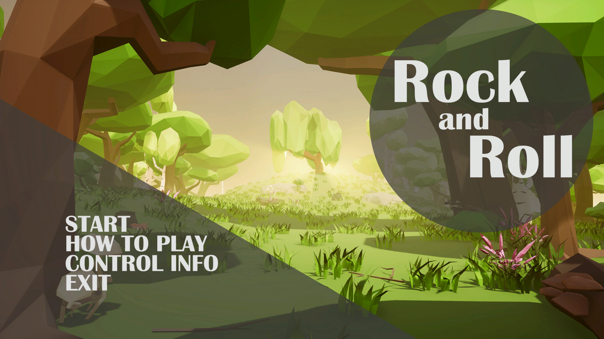

CIS568 Unreal Engine 4 Project: Rock And Roll
=============================================

**University of Pennsylvania, CIS 568: Game Design Practicum, Project 2**

Designed and implemented a phisical puzzle game Rock And Roll in Unreal game engine. The game was implemented in 3D.

**Game Introduction:**
Rock and Roll is a physically based puzzle solving game in Unreal Engine 4. A ball will roll into the ground and follow basic physics laws. Also, it will interact with the environment and may make turns, acceleration, deceleration or swap speed with another ball. The goal is help the ball with the items you have to get to the final destination by changing the environment.

  

**Demos:**
* [Trailer video](https://www.youtube.com/watch?v=UoCXtykFH8o)
* [Gameplay Video](https://www.youtube.com/watch?v=amp54_yxOrs)

**Group Member and Responsibilities:**
* [Yalun Hu](https://github.com/chestnutwww):
	* Grid-based placement
	* UI design and implementation
	* Data structure design and implementation
	* Level implementation
* [Jiahao Liu](https://github.com/lostink):
	* Level design
	* Debugging and parameter optimization
	* Level implementation
* [Xinyu Lin](https://github.com/460xlin):
	* Item design and implementation
	* Level implementation

# Features

## 1. Descriptive tutorial

* "How to play"
	* Teach the player the rules and procedures of the game in a descriptive way.

* Control Information
	* Tell the player the control information.

## 2. Tutorial levels

The game has 9 levels. The first 5 levels are tutorial levels that teach the player how to use each item in the game.

## 3. Phisically based gameplay

The game consist of two parts: placing and playing.

* Placing part:
Select items and place them on proper positions.

* Playing part:
Release the ball to see if it can get the destination.

## 4. Differet kinds of items

Items are used to help the ball get the destination.

* Left/Right turn
	* The ball will turn left/right if it hits this item.

* Acceleration/Decceleration
	* The ball will Accelerate/Deccelerate if it passes through this item.

* Normal Cube
	* This item will block the ball or fill the hole on the ground.

# References

* [Grid-based placement tutorial](https://www.youtube.com/watch?v=JyjNE6CE-U4&t=352s)
* [Official Unreal Engine 4 documentation](https://docs.unrealengine.com/en-us)

# Additional Assets

* [Low Poly Forest Asset Pack](https://www.unrealengine.com/marketplace/low-poly-forest-asset-pack)
* [Simplistic Low Poly Seasonal Forest Pack](https://www.unrealengine.com/marketplace/stylized-low-poly-seasonal-forest-pack)
* [Trailer BGM: Country Boy](https://www.bensound.com/royalty-free-music/track/country-boy)
